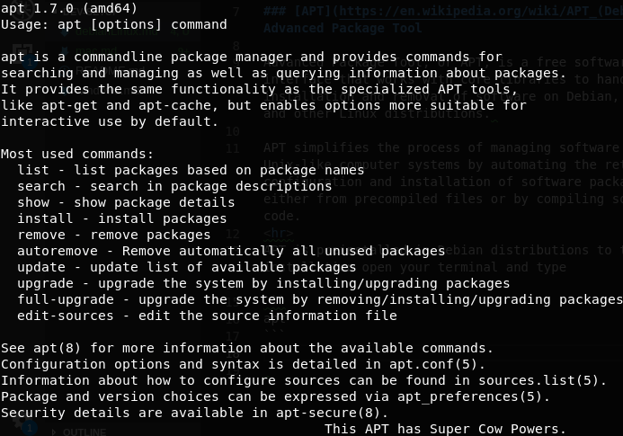
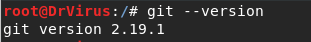
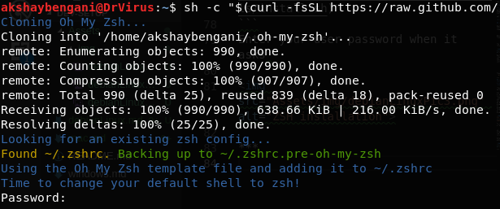
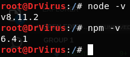

# Debian Distribution for Development

Basic dev enviorment setup for Linux users (Debian Distribution)


## [APT](https://en.wikipedia.org/wiki/APT_(Debian)) Advanced Package Tool
<hr>


Advanced Package Tool, or APT, is a free software user interface that works with core libraries to handle the installation and removal of software on Debian, Ubuntu and other Linux distributions. 

APT simplifies the process of managing software on Unix-like computer systems by automating the retrieval, configuration and installation of software packages, either from precompiled files or by compiling source code.

APT is preinstalled in Debian distributions to test its installation open your terminal and type

```
apt
```
Output would be something like this



## APT Update and Upgrade

**Update** is used to resynchronize the package index files from their sources. The lists of available packages are fetched from the location(s) specified in /etc/apt/sources.list.

```
apt-get update
```

**Upgrade** is used to install the newest versions of all packages currently installed on the system from the sources enumerated in /etc/apt/sources.list. Packages currently installed with new versions available are retrieved and upgraded.

```
apt-get upgrade
```
## APT install 

**Install** is used to install the package you want to install for example if you want **VLC** to install in system use
```
apt-get install vlc
```
<hr>

## [Git](http://git-scm.com/)

What's a developer without [Git](http://git-scm.com/)? To install, simply run:

    $ apt-get install git
    
When done, to test that it installed fine you can run:

    $ git --version
    
The output would be something like this



Next, we'll define your Git user (should be the same name and email you use for [GitHub](https://github.com/) and [Heroku](http://www.heroku.com/)):

    $ git config --global user.name "Your Name Here"
    $ git config --global user.email "your_email@youremail.com"

They will get added to your `.gitconfig` file.

***
## [Oh My Zsh](https://github.com/robbyrussell/oh-my-zsh) (Optional but highly recommended)

"Your terminal never felt this good before."

Zsh is an extended Bourne shell with a large number of improvements, including some features of Bash, ksh, and tcsh and Oh My Zsh is an open source, community-driven framework for managing your zsh configuration. Oh My Zsh comes with a shitload of plugins and themes to take advantage of. It comes pre-installed with some plugins which will make your Terminal look clutter-free, and lots of theme options, many of which display version-control data:


To install Oh My Zsh, paste this at a Terminal prompt

```
sh -c "$(curl -fsSL https://raw.github.com/robbyrussell/oh-my-zsh/master/tools/install.sh)"
```
Enter your user password when it asks 



***


## Node.js and NPM

### [Node.js](https://nodejs.org)

Node.js® — a version of Chrome’s V8 JavaScript runtime engine — which makes it possible to run JavaScript on the server-side.

Node.js is also used for deploying tools that make developing web sites simpler. For example, by installing Node.js on your desktop machine, you can quickly convert CoffeeScript to JavaScript, SASS to CSS, and shrink the size of your HTML, JavaScript and graphic files.

```
apt-get install npm
```
When done, to test that it installed fine you can run:
```
node -v
```
### [NPM](https://npmjs.com)

NPM — a tool that makes installing and managing Node modules — it’s quite easy to add many useful tools to your web development toolkit.

npm is distributed with Node.js which means that when you intall Node.js, you automatically get npm installed on your computer. To see if NPM is installed, type `npm -v` in Terminal. This should print NPM’s version number so you’ll see something like this 5.6.0

```
npm -v
```




***

